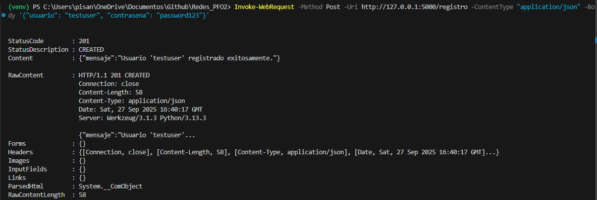
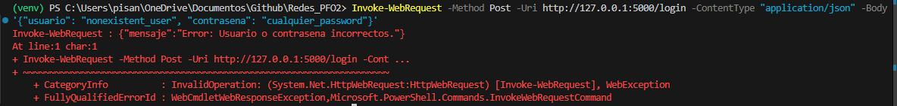
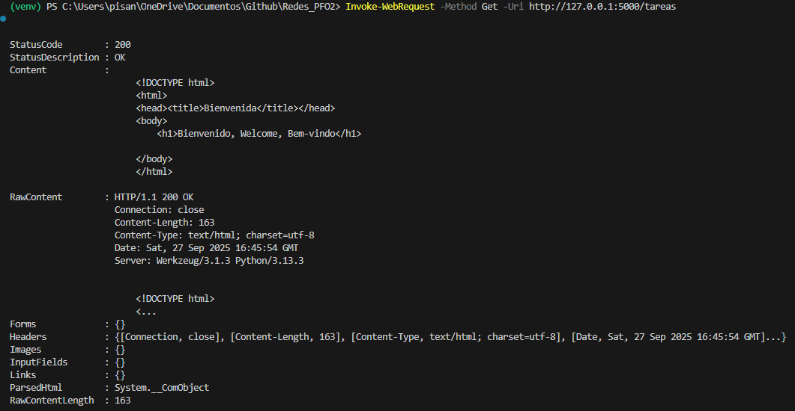

# PFO 2: Sistema de Gestión de Tareas con API y Base de Datos

## Instrucciones para Ejecutar el Proyecto
Este proyecto implementa una API REST básica para la gestión de usuarios (registro e inicio de sesión) utilizando Flask y SQLite. Las contraseñas se almacenan de forma segura mediante *hashing* con Werkzeug.

### Requisitos
* Python 3.x
* Librerías de Python: `Flask` (incluye `Werkzeug` para *hashing*).

### A. Instalación de Dependencias

1.  **Clonar el repositorio:**
    git clone [nombre del repositorio]
    cd [nombre del repositorio]

2.  **Crear y activar un entorno virtual (Recomendado):**
    python3 -m venv venv
    .\venv\Scripts\activate

3.  **Instalar Flask:**
    pip install Flask

---
### B. Ejecución del Servidor
1.  Asegúrate de estar en el directorio del proyecto y de que el entorno virtual esté activo.
2.  Ejecuta el servidor:

    python servidor.py

    El servidor se iniciará en `http://127.0.0.1:5000`.

---
### C. Prueba de Endpoints 

El archivo `servidor.py` creará la base de datos `usuarios.db` automáticamente al ejecutarse por primera vez.

#### 1. Registro de Usuario (`POST /registro`)

Crea un nuevo usuario en la base de datos.

**Ejemplo de solicitud:**

Invoke-WebRequest -Method Post -Uri [http://127.0.0.1:5000/registro](http://127.0.0.1:5000/registro) -ContentType "application/json" -Body '{"usuario": "ernesto", "contrasena": "mipass123"}'
Resultado Esperado:

{"mensaje": "Usuario 'ernesto' registrado exitosamente."}
Código de estado: 201 Created

2. Inicio de Sesión (POST /login)
Autentica a un usuario verificando sus credenciales.
Ejemplo de solicitud:

Invoke-WebRequest -Method Post -Uri [http://127.0.0.1:5000/login](http://127.0.0.1:5000/login) -ContentType "application/json" -Body '{"usuario": "ernesto", "contrasena": "mipass123"}'
Resultado Esperado:

{"mensaje": "Inicio de sesion exitoso! Bienvenido, ernesto."}
Código de estado: 200 OK

3. Vista de Tareas (GET /tareas)
Muestra una página de bienvenida al acceder a la URL.
Ejemplo de solicitud:

Invoke-WebRequest -Method Get -Uri [http://127.0.0.1:5000/tareas](http://127.0.0.1:5000/tareas)
Resultado Esperado:
Retorna una página HTML simple en el navegador.

Código de estado: 200 OK

### D. Repositorio en  Github
https://github.com/espisano/Redes_PFO2